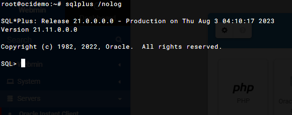

# Oracle Instant Client

## Webmin Module for installing Oracle Instant Client


# About

Installs Oracle Instant Client Basic, jdbc, odbc, sdk, sqlplus, and tools packages

# Install via Webmin

Webmin->Webmin Configuration->Webmin Modules->From ftp or http URL

URL: http://github.com/cited/Oracle-Instant-Client/raw/master/scripts/Oracle-Instant-Client.wbm.gz

Go to Servers->Apache Tomcat to complete set up using the setup Wizard (you may need to refresh page).

# Install via Script

As Root:

```bash
wget https://raw.githubusercontent.com/cited/Oracle-Instant-Client/master/scripts/pre-install.sh
chmod +x pre-install.sh
./pre-install.sh
```

Go to Servers->Apache Tomcat to complete set up using the setup Wizard.

# Install via GIT

As Root:

```bash
git clone https://github.com/cited/Oracle-Instant-Client
mv Oracle-Instant-Client oci
tar -cvzf oci.wbm.gz oci/
```

Upload from Webmin->Webmin Configuration->Webmin Modules

Go to Servers->Oracle Instant Client (you may need to refresh page)

## **Issues**
Please report issue here

# Screen Shots


# SQLPlus Connection via Webmin Terminal




Copyright
---------

* Copyright AcuGIS, 2020
* Copyright Cited, Inc., 2020


