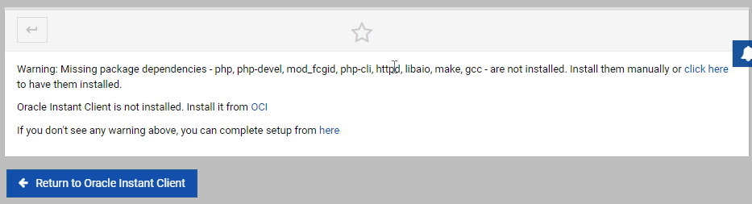
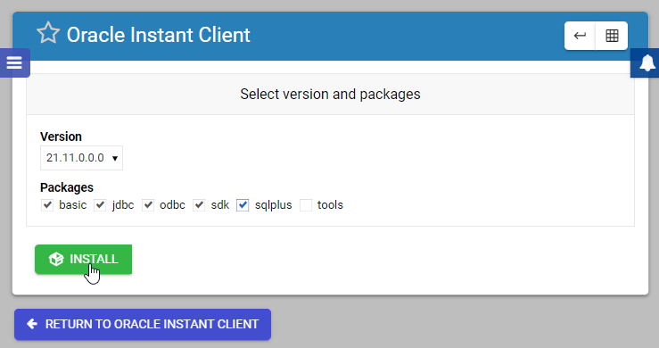
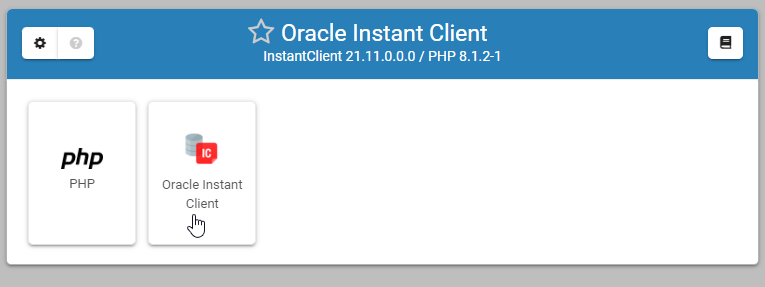
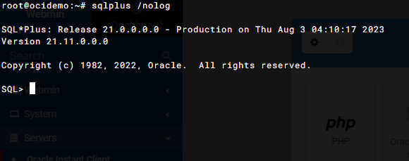

Installation
===========================

This module is for installing and configuring Oracle Instant Client

The module can be used on a new or existing Webmin installation

Installation
------------

Step 1: Get the repo from Github::

    git clone https://github.com/cited/Oracle-Instant-Client.git

Step 2: Change name::

    mv Oracle-Instant-Client oci

Step 4 Create the Webmin wbm.gz file::

    tar -cvzf oci.wbm.gz oci/

Step 5: Install the module (Ubuntu)::

    /usr/share/webmin/install-module.pl oci.wbm.gz

Step 5: Install the module (Rocky/Alma)::

    /usr/libexec/webmin/install-module.pl oci.wbm.gz

Wizard
-------   

Once the module is installed, go to Servers >> Oracle Instant Client

Click throught the Set Up Wizard

Select the package(s) you want to install

Once completed, the panel should look like below:

SQL Plus
-----------------

If you selected SQLPlus, you can test functionality via the Webmin terminal app:

Start SQL Plus

PHP OCI
-----------------

PHP oci funcationality can be tested using below

.. code-block:: console

    <?php
      
      $c = @oci_connect("username", "password", "hostname/servicename(pdb)");
      if (!$c) {
        print "Sorry! The connection to the database failed. Please try again later.";
        die();
      }
      else {
        print "Congrats! You've connected to an Oracle database!";
        oci_close($c);
      }
    ?>

Contribute
----------

- Issue Tracker: github.com/cited/Oracle-Instant-Client/issues
- Source Code: github.com/AcuGIS/Oracle-Instant-Client

Support
-------

If you are having issues, please let us know.
We have a mailing list located at: project@google-groups.com

License
-------

The project is licensed under the BSD license.
